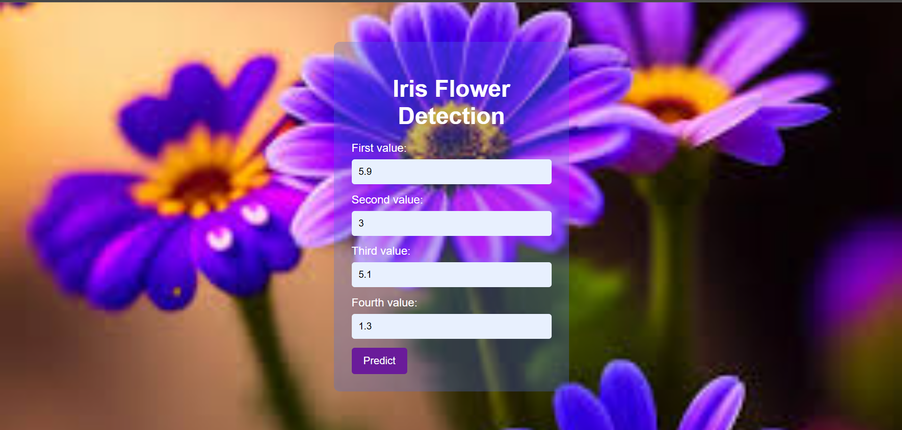
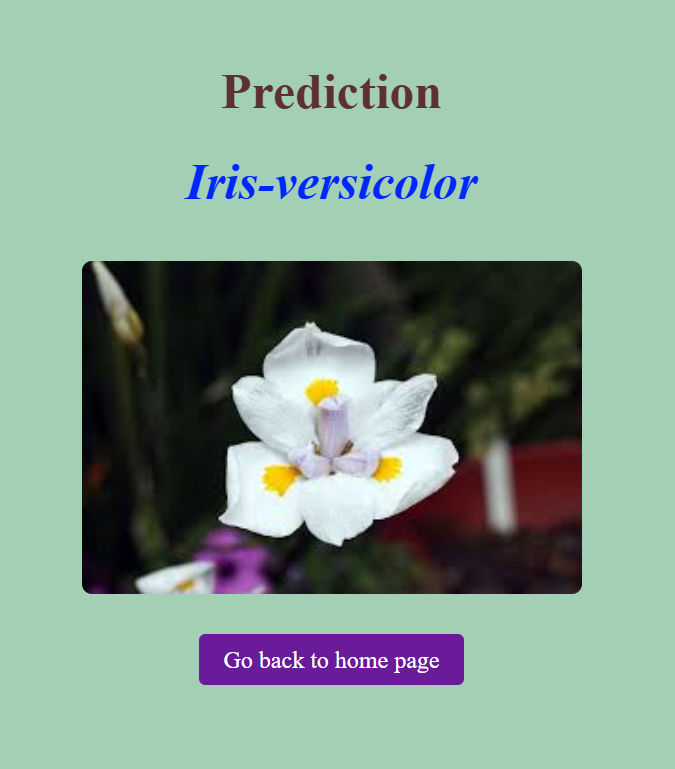

# Flower Prediction



Flower Prediction is a machine learning project that classifies iris flowers into three species: Setosa, Versicolor, and Virginica, based on the famous Iris dataset. This repository contains the code for data analysis, model training, evaluation, and deployment using a Flask web application.

## Prediction


## Table of Contents

- [Project Overview](#project-overview)
- [Features](#features)
- [Installation](#installation)
- [Usage](#usage)
- [Technologies Used](#technologies-used)
- [Contributing](#contributing)
- [License](#license)

## Project Overview

The Flower Prediction project aims to provide a simple yet effective machine learning model to classify iris flowers based on four features: sepal length, sepal width, petal length, and petal width. The project demonstrates the end-to-end process of building a machine learning application, from data analysis to deployment.

## Features

- **Data Analysis and Visualization**: Explore and visualize the Iris dataset.
- **Model Training**: Train multiple machine learning models.
- **Model Evaluation**: Evaluate the performance of trained models.
- **Web Application**: A Flask-based web interface for predicting flower species.

## Installation

Follow these steps to set up the project locally:

1. Clone the repository:
    ```bash
    git clone https://github.com/Murugavl/Flower-Prediction.git
    cd Flower-Prediction
    ```

2. Install the required dependencies:
    ```bash
    pip install -r requirements.txt
    ```

## Usage

To run the Flask application locally:

1. Start the Flask server:
    ```bash
    python app.py
    ```

2. Open your web browser and go to `http://127.0.0.1:5000/`.

3. Enter the measurements of the iris flower to get the predicted species.

## Technologies Used

- Python
- Flask
- Scikit-learn
- Pandas
- Matplotlib
- Seaborn

## Contributing

Contributions are welcome! Please fork the repository and create a pull request with your changes. For significant changes, please open an issue first to discuss what you would like to change.

## License

This project is licensed under the MIT License. See the [LICENSE](LICENSE) file for details.

---

Developed by [Murugavel V](https://github.com/your-profile).
